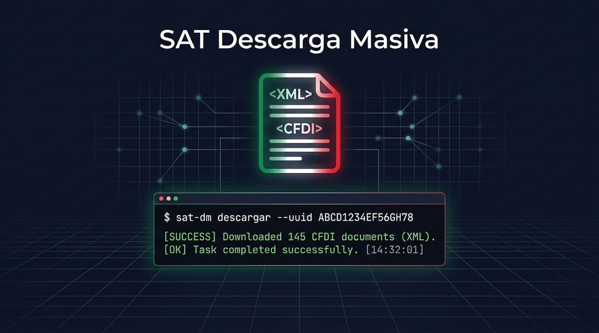

<p align="center">
  
</p>


# sat-descarga-masiva

[](https://github.com/soyisracastro/sat-dm/actions/workflows/tests.yml)
[](LICENSE)
[](https://www.python.org/downloads/)

Cliente Python para el **Web Service oficial de Descarga Masiva** del SAT (México).
Descarga CFDIs en formato XML de forma programática usando e-firma (FIEL).

## Por qué este cliente y no el portal web

| | Portal web | Este cliente |
|---|---|---|
| Método | Scraping | Web Service oficial |
| Límite | 2,000 CFDIs/día | 200,000 por solicitud |
| Autenticación | CIEC o e-firma | Solo e-firma |
| Estabilidad | Cambia el HTML | API estable |
| Proceso | Síncrono | Asíncrono (24-72 hrs) |

## Requisitos

- Python 3.9+
- [uv](https://docs.astral.sh/uv/)
- E-firma vigente (archivo `.cer` + `.key` + contraseña)

```bash
uv venv
uv pip install -r requirements.txt
```

Para el módulo CIEC (scraping del portal web):

```bash
uv run playwright install chromium
```

## Uso rápido — CLI multi-empresa

### 1. Registrar una empresa

```bash
uv run python sat_dm.py empresas add
# Pide: nombre, ruta .cer, ruta .key, contraseña
# Valida la e-firma y extrae el RFC automáticamente
```

### 2. Descargar CFDIs (interactivo)

```bash
uv run python sat_dm.py descargar
# Selecciona empresa, rango de fechas, tipo (E/R/Ambos)
# Los XMLs se guardan en ./descargas/{RFC}/emitidos/ y .../recibidos/
```

### 3. Descargar CFDIs (directo)

```bash
uv run python sat_dm.py descargar --rfc XAXX010101000 --desde 2025-01-01 --hasta 2025-12-31 --tipo A --estado V
```

### 4. Retomar solicitud interrumpida

```bash
uv run python sat_dm.py retomar <RequestID> --rfc XAXX010101000
```

### Otros comandos

```bash
uv run python sat_dm.py empresas list       # Listar empresas registradas
uv run python sat_dm.py empresas default    # Marcar empresa por defecto
uv run python sat_dm.py empresas remove     # Eliminar empresa
```

## Uso como librería Python

```python
from sat_descarga import descargar_cfdi
from datetime import date

descargar_cfdi(
    cer_path="mi_fiel.cer",
    key_path="mi_fiel.key",
    password="mi_contraseña",
    fecha_inicio=date(2025, 1, 1),
    fecha_fin=date(2025, 12, 31),
    tipo_comprobante="E",              # "E" = emitidos | "R" = recibidos
    estado_comprobante="Vigente",      # "Vigente", "Cancelado" o "Todos"
    directorio_salida="./cfdi/",
)
```

## Validar estatus de CFDIs ante el SAT

Verifica si tus CFDIs están **Vigentes**, **Cancelados** o **No Encontrados** — directo contra el SAT, sin FIEL (endpoint público).

```bash
# Validar todos los XMLs de un directorio
uv run python sat_dm.py validar ./descargas/

# Con export a CSV
uv run python sat_dm.py validar ./descargas/ -o resultado_validacion.csv

# Ajustar concurrencia (default: 10 hilos)
uv run python sat_dm.py validar ./xmls/ -c 20
```

Desde Python:

```python
from sat_descarga.validacion import validar_cfdi, validar_masivo

# Un solo CFDI
resultado = validar_cfdi(
    uuid="AAAAAAAA-BBBB-CCCC-DDDD-EEEEEEEEEEEE",
    emisor_rfc="AAA010101AAA",
    receptor_rfc="BBB020202BBB",
    total=1160.00,
)
print(resultado.estado)  # "Vigente", "Cancelado" o "No Encontrado"

# Masivo (10 hilos en paralelo)
cfdis = [
    {"uuid": "...", "emisor_rfc": "...", "receptor_rfc": "...", "total": 1000.0},
    # ...
]
resultados = validar_masivo(cfdis, concurrency=10)
```

## Descarga de metadata (sin descargar XMLs)

La metadata es un resumen de tus CFDIs (UUID, RFC, monto, estatus) que el SAT procesa en **segundos** — sin esperar 72 horas ni descargar GBs de XMLs.

| | Descarga CFDI | Descarga Metadata |
|---|---|---|
| Contenido | XMLs completos | CSV con resumen |
| Límite | 200,000 por solicitud | 1,000,000 por solicitud |
| Tiempo SAT | 24-72 horas | Segundos a minutos |
| Peso | GBs | MBs |

```bash
# Descargar metadata de emitidos
uv run python sat_dm.py metadata --desde 2025-01-01 --hasta 2025-12-31

# Recibidos, con export a CSV
uv run python sat_dm.py metadata --desde 2025-01-01 --hasta 2025-12-31 -t R --csv-export reporte.csv
```

### Casos de uso de metadata

- **Conteo rápido** — cuántos CFDIs tienes en un periodo, sin esperar horas
- **Reporte de facturación** — export CSV/Excel con montos por RFC
- **Detección de cancelados** — qué facturas cancelaron y cuándo
- **Filtrar y luego descargar** — identificar UUIDs relevantes, luego descargar solo esos
- **Conciliación** — comparar lo que el SAT reporta vs tu sistema contable

## Descarga por UUIDs específicos

Descarga CFDIs individuales por su UUID, sin importar periodo. Útil después de filtrar con metadata.

```python
from sat_descarga.client import descargar_por_uuid

descargar_por_uuid(
    cer_path="mi_fiel.cer",
    key_path="mi_fiel.key",
    password="mi_contraseña",
    uuids=["UUID-1111-...", "UUID-2222-...", "UUID-3333-..."],
    directorio_salida="./cfdi/",
)
```

## Organizar archivos XML

Herramientas para organizar, renombrar y deduplicar los XMLs descargados.

### Organizar en carpetas

```bash
# Por RFC emisor / año / mes (default)
uv run python sat_dm.py organizar carpetas ./descargas/ -d ./organizado/

# Por tipo de comprobante / año / mes
uv run python sat_dm.py organizar carpetas ./descargas/ -d ./organizado/ -e tipo/anio/mes

# Copiar en lugar de mover
uv run python sat_dm.py organizar carpetas ./descargas/ -d ./organizado/ --copiar
```

Estructuras disponibles: `rfc_emisor/anio/mes`, `rfc_emisor/anio`, `anio/mes/rfc_emisor`, `anio/mes`, `anio/mes/dia`, `tipo/anio/mes`, `rfc_emisor/tipo/anio/mes`, `rfc_receptor/anio/mes`, `plano`.

### Renombrar masivamente

```bash
# Por emisor + fecha + total (default)
uv run python sat_dm.py organizar renombrar ./xmls/
# Resultado: AAA010101AAA_2025-06-15_1160.00_12345678.xml

# Solo por UUID
uv run python sat_dm.py organizar renombrar ./xmls/ -p uuid
```

Patrones: `emisor_fecha_total`, `receptor_fecha_total`, `uuid`, `fecha_emisor_total`, `fecha_uuid`.

### Eliminar duplicados

```bash
# Ver duplicados sin eliminar
uv run python sat_dm.py organizar deduplicar ./xmls/ --dry-run

# Eliminar duplicados (por UUID)
uv run python sat_dm.py organizar deduplicar ./xmls/
```

## Servidor local (FastAPI)

El servidor en `localhost:8787` permite que aplicaciones web (como [todoconta](https://apps.todoconta.com)) interactúen con el SAT sin que la e-firma salga de tu máquina.

```bash
uv run uvicorn sat_descarga.server:app --port 8787
```

### Endpoints disponibles

| Endpoint | Auth | Descripción |
|---|---|---|
| `GET /health` | No | Estado del servidor |
| `POST /auth/cargar-fiel` | No | Cargar e-firma en memoria |
| `DELETE /auth/fiel` | No | Descargar e-firma de memoria |
| `POST /solicitar` | FIEL | Solicitar descarga de CFDIs |
| `POST /verificar` | FIEL | Verificar estado de solicitud |
| `POST /descargar` | FIEL | Descargar paquetes listos |
| `POST /solicitar-folio` | FIEL | Descarga por lista de UUIDs |
| `POST /metadata` | FIEL | Descarga metadata (CSV rápido) |
| `POST /validar` | No | Validar estatus CFDI ante SAT |
| `POST /descarga-completa` | FIEL | Flujo completo (bloquea) |
| `POST /descarga-inteligente` | FIEL | Auto-elige CIEC o Web Service |
| `POST /ciec/descargar` | CIEC | Descarga via portal web |

> `POST /validar` no requiere FIEL — cualquier app puede llamarlo para verificar CFDIs.

## Estructura del proyecto

```
sat_descarga/              # Core: protocolo SOAP del SAT (sin I/O de terminal)
├── config.py              # Endpoints, constantes, timeouts
├── fiel.py                # Carga e-firma y firma RSA-SHA1
├── http_client.py         # HTTP con 6 reintentos y TLS 1.2
├── auth.py                # Autenticación SOAP → token
├── solicitud.py           # SolicitaDescarga → RequestID
├── verificacion.py        # Polling del estado → PackageIDs
├── descarga.py            # Descarga ZIPs y extrae XMLs
├── client.py              # Orquestador principal
├── server.py              # FastAPI (localhost:8787)
├── validacion.py          # Validación estatus CFDI ante SAT
├── metadata.py            # Parser de metadata CSV del SAT
├── xml_reader.py          # Parser ligero de XML CFDI (headers)
└── organizador.py         # Organizar, renombrar, deduplicar XMLs

cli/                       # CLI multi-empresa (click)
├── main.py                # Grupo principal de comandos
├── empresas.py            # Gestión de empresas/FIELs
├── descargar.py           # Flujo de descarga + retomar
├── validar.py             # Validación masiva contra SAT
├── metadata_cmd.py        # Descarga de metadata
├── organizar.py           # Organizar/renombrar/deduplicar
├── config_store.py        # Persistencia (~/.sat-descarga/)
└── display.py             # Formato de salida

sat_dm.py                  # Entry point: python sat_dm.py
```

## Flujo de 3 pasos

```
1. SolicitaDescarga ──→ RequestID
         │
         ↓ (asíncrono, puede tardar horas)
2. VerificaSolicitud ──→ PackageIDs  (polling hasta status=3)
         │
         ↓
3. DescargaMasiva ──→ ZIP con XMLs
```

### Estados de verificación

| CodEstado | Significado |
|---|---|
| 1 | En cola |
| 2 | Procesando |
| **3** | **Lista — ya se puede descargar** |
| 4 | Error en el SAT |
| 5 | Rechazada (límites excedidos u otro) |

## Retomar una solicitud interrumpida

Si el proceso se cortó durante el polling (puede durar hasta 72 hrs):

```bash
uv run python sat_dm.py retomar <RequestID> --rfc XAXX010101000
```

O desde Python:

```python
from sat_descarga import verificar_solicitud_existente

verificar_solicitud_existente(
    cer_path="mi_fiel.cer",
    key_path="mi_fiel.key",
    password="mi_contraseña",
    id_solicitud="el-request-id-anterior",
    directorio_salida="./cfdi/",
    poll=True,
)
```

## Tipos de solicitud

| Parámetro | Valor | Descripción | Límite |
|---|---|---|---|
| `tipo_solicitud` | `"CFDI"` | XMLs completos | 200,000 por solicitud |
| `tipo_solicitud` | `"Metadata"` | Solo metadatos (RFC, monto, etc.) | 1,000,000 por solicitud |
| `tipo_comprobante` | `"E"` | Comprobantes emitidos | — |
| `tipo_comprobante` | `"R"` | Comprobantes recibidos | — |
| `estado_comprobante` | `"Vigente"` | Solo comprobantes vigentes | — |
| `estado_comprobante` | `"Cancelado"` | Solo cancelados (no aplica en recibidos para CFDI) | — |
| `estado_comprobante` | `"Todos"` | Vigentes y cancelados | — |

> **Nota:** Para recibidos con `tipo_solicitud="CFDI"`, el SAT solo permite `estado_comprobante="Vigente"`.
> Solicitar cancelados en recibidos retorna error 301.

## Problemas conocidos del SAT y soluciones aplicadas

| Problema | Solución |
|---|---|
| SSL/TLS inestable (~25% de fallos) | TLSv1.2 + 6 reintentos con backoff |
| Token expira en ~5 min | Se renueva automáticamente antes de descargar |
| ZIPs grandes corrompen el parser XML | `lxml` con flag `huge_tree=True` |
| Procesamiento asíncrono | Polling con backoff exponencial (30s → 5min) |
| "Solicitudes agotadas de por vida" | El SAT limita solicitudes por rango exacto de fechas; variar los segundos genera una solicitud nueva |
| Recibidos requiere `RfcReceptor` | Se incluye automáticamente (igual al RFC solicitante) |
| `EstadoComprobante` requerido para CFDI | Valores: `"Vigente"`, `"Cancelado"`, `"Todos"` (no numéricos) |

## Endpoints del Web Service

| Servicio | URL |
|---|---|
| Autenticación | `https://cfdidescargamasivasolicitud.clouda.sat.gob.mx/Autenticacion/Autenticacion.svc` |
| SolicitaDescarga | `https://cfdidescargamasivasolicitud.clouda.sat.gob.mx/SolicitaDescargaService.svc` |
| VerificaSolicitud | `https://cfdidescargamasivasolicitud.clouda.sat.gob.mx/VerificaSolicitudDescargaService.svc` |
| DescargaMasiva | `https://cfdidescargamasiva.clouda.sat.gob.mx/DescargaMasivaService.svc` |

## Tests

```bash
uv run pytest -v
```

Los tests se corren automáticamente en cada push/PR vía GitHub Actions (Python 3.10 a 3.13).

## Notas importantes

- Solo funciona con **e-firma vigente** (`.cer` + `.key`). No funciona con CIEC.
- Solo acceso a los **últimos 5 años fiscales** (vigente desde mayo 2025, versión 1.5 del servicio).
- El procesamiento es asíncrono: el SAT puede tardar entre minutos y 72 horas.
- Probado exitosamente con descarga real de ~950 CFDIs (emitidos + recibidos) del año 2025.

## Licencia

[MIT](LICENSE)
