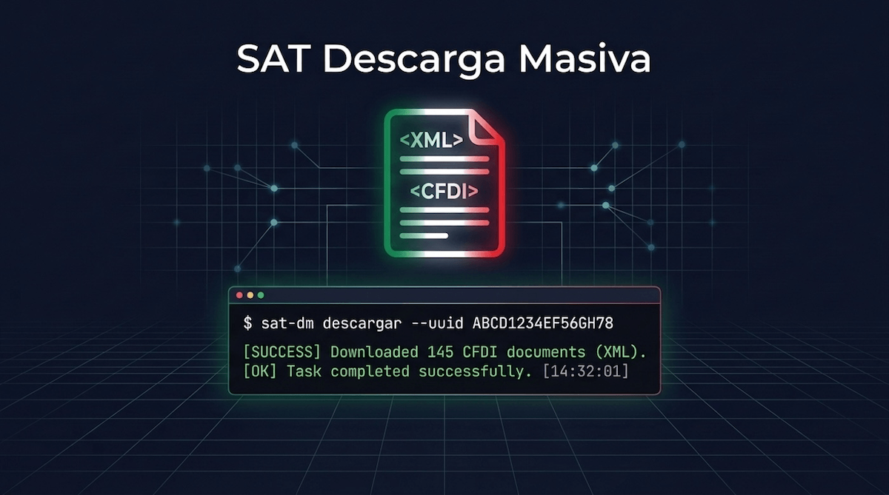

<p align="center">
  
</p>


# sat-descarga-masiva

[](https://github.com/soyisracastro/sat-dm/actions/workflows/tests.yml)
[](LICENSE)
[](https://www.python.org/downloads/)

Cliente Python para descargar CFDIs (XML) del SAT (México) de forma programática.
Dos vías complementarias:

- **Web Service oficial** con e-firma (FIEL) — método recomendado, asíncrono y de alto volumen.
- **Portal web** con CIEC (RFC + contraseña) — para contribuyentes **sin e-firma**, vía scraping.

## Por qué el Web Service (y cuándo usar CIEC)

| | Portal web (CIEC) | Web Service oficial |
|---|---|---|
| Método | Scraping (Playwright) | API SOAP oficial |
| Límite | ~2,000 CFDIs/día | 200,000 por solicitud |
| Autenticación | RFC + CIEC | e-firma (FIEL) |
| Estabilidad | Cambia el HTML | API estable |
| Proceso | Síncrono (resuelves captcha) | Asíncrono (24-72 hrs) |

Este cliente prioriza el Web Service, pero incluye el modo **CIEC** para cuando el
contribuyente no cuenta con e-firma.

> 📦 **Versionado**: este proyecto sigue [Semantic Versioning](https://semver.org/lang/es/) con tags `vX.Y.Z`. Ver [docs/versionado.md](docs/versionado.md) para la convención completa.

## Requisitos

- Python 3.9+
- [uv](https://docs.astral.sh/uv/)
- E-firma vigente (`.cer` + `.key` + contraseña) **para el Web Service**, o RFC + CIEC para el portal

```bash
uv venv
uv pip install -e .          # instala deps + el comando `sat-dm`
```

Para las descargas vía portal (CIEC / e.firma) se necesita además Playwright (extra `ciec`):

```bash
uv pip install -e ".[ciec]"  # playwright + pillow
uv run playwright install chromium
```

## Uso rápido — CLI `sat-dm`

Todo se hace con un solo comando, `sat-dm` (se instala con `uv pip install -e .`).
Las descargas viven bajo el grupo `descargar`: `cfdi` (Web Service), `ciec` (portal) y
`constancia` (documento).

### 1. Registrar una empresa

```bash
sat-dm empresas add
# Pide: nombre, ruta .cer, ruta .key, contraseña. Valida la e-firma y extrae el RFC.
```

### 2. Descargar CFDIs por Web Service (FIEL)

```bash
sat-dm descargar cfdi                 # interactivo (empresa, fechas, tipo E/R/Ambos)
sat-dm descargar cfdi --rfc XAXX010101000 --desde 2025-01-01 --hasta 2025-12-31 --tipo A --estado V
# Los XMLs se guardan en ./descargas/{RFC}/emitidos/ y .../recibidos/
```

### 3. Retomar solicitud interrumpida

```bash
sat-dm retomar <RequestID> --rfc XAXX010101000
```

### Otros comandos

```bash
sat-dm empresas list | default | remove   # gestionar empresas
sat-dm validar ./xmls/                     # validar estatus ante el SAT
sat-dm metadata --desde 2025-01-01 --hasta 2025-01-31   # metadata (resumen rápido)
sat-dm organizar carpetas | renombrar | deduplicar      # organizar XMLs
```

## Descargar CFDIs vía CIEC (sin e-firma)

Para contribuyentes sin e-firma: scraping del portal con RFC + contraseña CIEC. Abre un
Chromium **visible**, resuelves el captcha y «Enviar», y el resto (búsqueda + descarga
item por item) es automático.

```bash
sat-dm descargar ciec --rfc RFC --desde 2025-01-01 --hasta 2025-01-31           # ambos (RE)
sat-dm descargar ciec --rfc RFC --desde 2025-01-01 --hasta 2025-01-31 --tipo E  # solo emitidos
# Pide la contraseña CIEC de forma oculta. XMLs en ./cfdi_ciec_<RFC>/ (subcarpetas R/E).
```

Sujeto a la **cuota diaria** del portal (~2,000/día); si se agota, se detiene y retomas al
día siguiente. Como librería: `from sat_descarga import descargar_cfdi_ciec`.

## Descargar Constancia de Situación Fiscal (CSF)

Genera y guarda el PDF de la constancia. Dos métodos de login:

```bash
# Con CIEC (resuelves el captcha en el browser):
sat-dm descargar constancia --metodo ciec --rfc RFC

# Con e.firma (FIEL) — 100% automático, SIN captcha:
sat-dm descargar constancia --metodo fiel --cer ruta.cer --key ruta.key
# PDF en ./constancia_<RFC>/ (o ./constancia_fiel/)
```

Con **e.firma** el flujo es totalmente desatendido (no hay captcha), ideal para
automatización. Como librería: `from sat_descarga import descargar_constancia_ciec,
descargar_constancia_fiel`. También por API: `POST /constancia/descargar`.

## Uso como librería Python

```python
from sat_descarga import descargar_cfdi
from datetime import date

descargar_cfdi(
    cer_path="mi_fiel.cer",
    key_path="mi_fiel.key",
    password="mi_contraseña",
    fecha_inicio=date(2025, 1, 1),
    fecha_fin=date(2025, 12, 31),
    tipo_comprobante="E",              # "E" = emitidos | "R" = recibidos
    estado_comprobante="Vigente",      # "Vigente", "Cancelado" o "Todos"
    directorio_salida="./cfdi/",
)
```

## Validar estatus de CFDIs ante el SAT

Verifica si tus CFDIs están **Vigentes**, **Cancelados** o **No Encontrados** — directo contra el SAT, sin FIEL (endpoint público).

```bash
# Validar todos los XMLs de un directorio
sat-dm validar ./descargas/

# Con export a CSV
sat-dm validar ./descargas/ -o resultado_validacion.csv

# Ajustar concurrencia (default: 10 hilos)
sat-dm validar ./xmls/ -c 20
```

Desde Python:

```python
from sat_descarga.utils.validacion import validar_cfdi, validar_masivo

# Un solo CFDI
resultado = validar_cfdi(
    uuid="AAAAAAAA-BBBB-CCCC-DDDD-EEEEEEEEEEEE",
    emisor_rfc="AAA010101AAA",
    receptor_rfc="BBB020202BBB",
    total=1160.00,
)
print(resultado.estado)  # "Vigente", "Cancelado" o "No Encontrado"

# Masivo (10 hilos en paralelo)
cfdis = [
    {"uuid": "...", "emisor_rfc": "...", "receptor_rfc": "...", "total": 1000.0},
    # ...
]
resultados = validar_masivo(cfdis, concurrency=10)
```

## Descarga de metadata (sin descargar XMLs)

La metadata es un resumen de tus CFDIs (UUID, RFC, monto, estatus) que el SAT procesa en **segundos** — sin esperar 72 horas ni descargar GBs de XMLs.

| | Descarga CFDI | Descarga Metadata |
|---|---|---|
| Contenido | XMLs completos | CSV con resumen |
| Límite | 200,000 por solicitud | 1,000,000 por solicitud |
| Tiempo SAT | 24-72 horas | Segundos a minutos |
| Peso | GBs | MBs |

```bash
# Descargar metadata de emitidos
sat-dm metadata --desde 2025-01-01 --hasta 2025-12-31

# Recibidos, con export a CSV
sat-dm metadata --desde 2025-01-01 --hasta 2025-12-31 -t R --csv-export reporte.csv
```

### Casos de uso de metadata

- **Conteo rápido** — cuántos CFDIs tienes en un periodo, sin esperar horas
- **Reporte de facturación** — export CSV/Excel con montos por RFC
- **Detección de cancelados** — qué facturas cancelaron y cuándo
- **Filtrar y luego descargar** — identificar UUIDs relevantes, luego descargar solo esos
- **Conciliación** — comparar lo que el SAT reporta vs tu sistema contable

## Descarga por UUIDs específicos

Descarga CFDIs individuales por su UUID, sin importar periodo. Útil después de filtrar con metadata.

```python
from sat_descarga.webservice.client import descargar_por_uuid

descargar_por_uuid(
    cer_path="mi_fiel.cer",
    key_path="mi_fiel.key",
    password="mi_contraseña",
    uuids=["UUID-1111-...", "UUID-2222-...", "UUID-3333-..."],
    directorio_salida="./cfdi/",
)
```

## Organizar archivos XML

Herramientas para organizar, renombrar y deduplicar los XMLs descargados.

### Organizar en carpetas

```bash
# Por RFC emisor / año / mes (default)
sat-dm organizar carpetas ./descargas/ -d ./organizado/

# Por tipo de comprobante / año / mes
sat-dm organizar carpetas ./descargas/ -d ./organizado/ -e tipo/anio/mes

# Copiar en lugar de mover
sat-dm organizar carpetas ./descargas/ -d ./organizado/ --copiar
```

Estructuras disponibles: `rfc_emisor/anio/mes`, `rfc_emisor/anio`, `anio/mes/rfc_emisor`, `anio/mes`, `anio/mes/dia`, `tipo/anio/mes`, `rfc_emisor/tipo/anio/mes`, `rfc_receptor/anio/mes`, `plano`.

### Renombrar masivamente

```bash
# Por emisor + fecha + total (default)
sat-dm organizar renombrar ./xmls/
# Resultado: AAA010101AAA_2025-06-15_1160.00_12345678.xml

# Solo por UUID
sat-dm organizar renombrar ./xmls/ -p uuid
```

Patrones: `emisor_fecha_total`, `receptor_fecha_total`, `uuid`, `fecha_emisor_total`, `fecha_uuid`.

### Eliminar duplicados

```bash
# Ver duplicados sin eliminar
sat-dm organizar deduplicar ./xmls/ --dry-run

# Eliminar duplicados (por UUID)
sat-dm organizar deduplicar ./xmls/
```

## Servidor local (FastAPI)

El servidor en `localhost:8787` permite que aplicaciones web (como [todoconta](https://apps.todoconta.com))
y el shell de escritorio Electron interactúen con el SAT sin que la e-firma salga de tu
máquina. La e-firma se carga en memoria (o desde el catálogo local en keychain) y nunca se
envía a ningún servidor remoto.

```bash
uv run uvicorn sat_descarga.api.server:app --port 8787
# Docs interactivas: http://127.0.0.1:8787/docs
```

CORS habilitado para `localhost:3000/3001`, `app.todoconta.com` y `todoconta.com`.
Solo se ejecuta **una operación de portal a la vez** (la sesión es de un usuario);
si hay un job activo y mandas otro, responde `409`.

### Estado del servidor

| Método | Endpoint | Auth | Descripción |
|---|---|---|---|
| `GET` | `/health` | — | Estado del servidor + e-firma cargada (incluye vencimiento y semáforo de vigencia) |

### Autenticación de e-firma (sesión en memoria)

| Método | Endpoint | Auth | Descripción |
|---|---|---|---|
| `POST` | `/auth/cargar-fiel` | — | Sube `.cer` + `.key` + contraseña (multipart) y deja la e-firma en memoria |
| `DELETE` | `/auth/fiel` | — | Limpia la e-firma de la sesión y borra archivos temporales |

> Al arrancar, el agente intenta cargar automáticamente la e-firma de la **empresa
> predeterminada** del catálogo (lifespan de FastAPI), para que `/health` ya refleje
> `efirma_lista=true` sin pasar por `/auth/cargar-fiel`.

### Web Service oficial (FIEL/SOAP)

| Método | Endpoint | Auth | Descripción |
|---|---|---|---|
| `POST` | `/solicitar` | FIEL | `SolicitaDescarga` → devuelve `RequestID`. Persiste la solicitud en el catálogo |
| `POST` | `/verificar` | FIEL | `VerificaSolicitud`. Si `poll=true` bloquea hasta `cod_estado=3` |
| `POST` | `/descargar` | FIEL | Descarga los paquetes ZIP de una solicitud lista (`?id_solicitud=...`) |
| `POST` | `/solicitar-folio` | FIEL | Descarga por lista de UUIDs específicos (auditorías) |
| `POST` | `/metadata` | FIEL | Descarga el CSV de metadata (rápido, segundos) y lo devuelve parseado |
| `POST` | `/descarga-completa` | FIEL | Flujo `solicitar→polling→descargar` en un único call (bloqueante; usar solo para scripts) |
| `POST` | `/descarga-inteligente` | FIEL | Cuenta vía metadata y autoenruta a CIEC (si `count < umbral_ciec` y se pasa `ciec`) o al Web Service |

### Validación de CFDIs (público, sin FIEL)

| Método | Endpoint | Auth | Descripción |
|---|---|---|---|
| `POST` | `/validar` | — | Verifica `Vigente / Cancelado / No Encontrado` contra `consultaqr.facturaelectronica.sat.gob.mx` (concurrencia configurable) |

### Portal — flujo síncrono (browser visible, captcha en ventana local)

| Método | Endpoint | Auth | Descripción |
|---|---|---|---|
| `POST` | `/ciec/descargar` | CIEC | Descarga CFDIs vía portal con CIEC. Abre Chromium visible, el usuario resuelve el captcha |
| `POST` | `/constancia/descargar` | CIEC | Constancia de Situación Fiscal (PDF) vía portal con CIEC |

### Portal — jobs con captcha in-app (SSE, browser headless)

Patrón usado por la app de escritorio: el browser corre **headless**, el agente expone el
captcha como base64 por SSE y la UI lo responde por `POST /jobs/{id}/captcha`. Cada
endpoint de lanzamiento devuelve `{job_id}`; el progreso (incluyendo `captcha_required`)
llega por `GET /events/{job_id}`.

| Método | Endpoint | Auth | Descripción |
|---|---|---|---|
| `POST` | `/ciec/cfdi` | CIEC | Lanza job de descarga de CFDIs vía CIEC |
| `POST` | `/ciec/constancia` | CIEC | Lanza job de Constancia de Situación Fiscal vía CIEC |
| `POST` | `/ciec/opinion` | CIEC | Lanza job de Opinión de Cumplimiento 32-D vía CIEC |
| `POST` | `/cfdi/fiel` | FIEL | Lanza job de CFDIs vía portal con e.firma (sin captcha) |
| `GET` | `/jobs/{job_id}` | — | Estado actual del job (`estado`, `resultado`, `error`) |
| `POST` | `/jobs/{job_id}/captcha` | — | Entrega la solución (`{solution}`) o cancela (`{solution: null}`) |
| `GET` | `/events/{job_id}` | — | Stream Server-Sent Events del progreso |

> La CIEC se puede omitir en el body si la empresa ya está registrada — el agente
> la resuelve desde el keychain del SO.

### Documentos vía e.firma (sin captcha)

| Método | Endpoint | Auth | Descripción |
|---|---|---|---|
| `POST` | `/constancia/fiel` | FIEL | Constancia de Situación Fiscal con la e.firma en sesión (síncrono) |
| `POST` | `/opinion/fiel` | FIEL | Opinión de Cumplimiento 32-D con la e.firma en sesión (síncrono) |

### Catálogo de empresas (persistente — keychain del SO)

El catálogo vive en `~/.sat-descarga/empresas.json`; las contraseñas (e.firma y CIEC) se
guardan **en el keychain** del SO, nunca en JSON.

| Método | Endpoint | Descripción |
|---|---|---|
| `GET` | `/empresas` | Lista las empresas registradas (sin credenciales) |
| `POST` | `/empresas/fiel` | Registra una empresa por e.firma (multipart: `.cer`, `.key`, `password`, `nombre`) |
| `POST` | `/empresas/ciec` | Registra una empresa por CIEC (`{rfc, nombre, ciec}`) |
| `DELETE` | `/empresas/{rfc}` | Elimina la empresa y borra sus credenciales del keychain |
| `PATCH` | `/empresas/{rfc}` | Actualiza campos editables (`regimenes_fiscales`, `actividades_economicas`) |
| `POST` | `/empresas/{rfc}/activar` | Activa la empresa para la sesión (carga e.firma si tiene FIEL) |
| `POST` | `/empresas/{rfc}/default` | Marca la empresa como predeterminada |
| `POST` | `/empresas/{rfc}/archive` | Soft-delete (la oculta de la lista principal) |
| `POST` | `/empresas/{rfc}/unarchive` | Regresa una empresa archivada a la lista |
| `GET` | `/empresas/{rfc}/solicitudes` | Historial de solicitudes WS de la empresa |
| `DELETE` | `/empresas/{rfc}/solicitudes/{id}` | Borra una solicitud del registro local |
| `GET` | `/empresas/{rfc}/historial` | Historial de descargas completadas de la empresa |
| `GET` | `/historial` | Historial de TODAS las empresas (con `rfc` + `nombre`) |
| `POST` | `/abrir` | Abre en el SO una descarga del historial (`{ruta, modo: "carpeta"\|"archivo"}`). Restringido a rutas presentes en el historial |

### Ajustes

| Método | Endpoint | Descripción |
|---|---|---|
| `GET` | `/config/descargas-dir` | Carpeta base de descargas (default `~/Documents/TodoConta`) |
| `PUT` | `/config/descargas-dir` | Cambia la carpeta base (`{dir}`) |

### Organizador de XMLs

| Método | Endpoint | Descripción |
|---|---|---|
| `POST` | `/organizar` | Mueve/copia XMLs a una estructura (`rfc_emisor/anio/mes`, etc.) |
| `POST` | `/renombrar` | Renombra masivamente según un patrón (`emisor_fecha_total`, `uuid`, etc.) |
| `POST` | `/deduplicar` | Elimina duplicados por UUID (soporta `dry_run`) |

### Procesador de comprobantes — CFDI

Buffer persistente en SQLite (`~/.sat-descarga/procesador.db`). Los XMLs se cargan
explícitamente (drag&drop / examinar / desde empresa) y se mantienen hasta que el
usuario los borra.

| Método | Endpoint | Descripción |
|---|---|---|
| `POST` | `/procesador/cfdi/cargar` | Sube `.xml` por multipart (hasta `MAX_BATCH_SIZE`) y los agrega al buffer |
| `POST` | `/procesador/cfdi/cargar-desde-empresa` | Escanea `descargas/cfdi/<RFC>/…` y agrega lo que encuentre |
| `POST` | `/procesador/cfdi/validar-sat` | Valida contra el SAT los CFDIs indicados (o los que no tienen `estado_sat`) |
| `GET` | `/procesador/cfdi` | Lista paginada con filtros (`desde`, `hasta`, `tipo`, `direccion`, `busqueda`, etc.) |
| `GET` | `/procesador/cfdi/stats` | KPIs agregados para las cards |
| `GET` | `/procesador/cfdi/reporte/{nombre}` | `totales-mes` · `top-contrapartes` · `integridad` |
| `GET`/`PUT` | `/procesador/cfdi/filtros` | Persiste los filtros activos de la sesión |
| `DELETE` | `/procesador/cfdi` | Vacía el buffer (CFDIs + filtros) |
| `GET` | `/procesador/cfdi/exportar` | Descarga el buffer filtrado como `xlsx` o `csv` |

### Procesador de comprobantes — Pagos (complemento 2.0)

Vista especializada sobre el buffer compartido + tabla `pagos_relaciones`. Detecta
huérfanos, extemporáneos e incidencias PUE+complemento. No tiene endpoints de carga
(los XMLs entran por `/procesador/cfdi/cargar`).

| Método | Endpoint | Descripción |
|---|---|---|
| `GET` | `/procesador/pagos` | Facturas PPD paginadas con `status` calculado |
| `GET` | `/procesador/pagos/stats` | KPIs de pagos |
| `GET` | `/procesador/pagos/factura/{uuid}/pagos` | Drilldown: pagos asociados a una PPD |
| `GET` | `/procesador/pagos/reporte/{nombre}` | `analisis-fechas` · `huerfanos` · `incidencias-pue` |
| `GET`/`PUT` | `/procesador/pagos/filtros` | Persiste filtros (status, búsqueda, fechas) |
| `GET` | `/procesador/pagos/exportar` | XLSX multi-sheet del módulo Pagos |

### Procesador de comprobantes — Nómina

Vista especializada con las tablas `nomina_recibos` y `nomina_conceptos`. Tres reportes:
deductibilidad fiscal, conciliación IMSS y periodo vs periodo.

| Método | Endpoint | Descripción |
|---|---|---|
| `GET` | `/procesador/nomina` | Recibos paginados (1 fila por CFDI tipo N) |
| `GET` | `/procesador/nomina/stats` | KPIs de nómina |
| `GET` | `/procesador/nomina/recibo/{uuid}/conceptos` | Drilldown: conceptos del recibo ordenados por clase |
| `GET` | `/procesador/nomina/reporte/{nombre}` | `deducibilidad` · `imss` · `periodo-vs-periodo` |
| `GET`/`PUT` | `/procesador/nomina/filtros` | Persiste filtros (tipo, periodicidad, fechas) |
| `GET` | `/procesador/nomina/exportar` | XLSX multi-sheet del módulo Nómina (con disclaimer fiscal) |

### Auth desktop — sesión TodoConta (device-code flow)

Proxy + cache hacia `todoconta-apps`. El Bearer de Supabase se guarda en el keychain del
SO y **nunca** se inyecta al renderer; este solo conoce el estado derivado.

| Método | Endpoint | Descripción |
|---|---|---|
| `POST` | `/auth/init` | Genera un `device_code` y devuelve la URL pública de activación |
| `POST` | `/auth/poll` | Polling del `device_code` (`pending` / `ok` / `expired` / `not_found`) |
| `GET` | `/auth/license` | Estado de licencia / Fundador (con cache; `?refresh=true` para invalidar) |
| `POST` | `/auth/upgrade` | Genera la URL de Stripe Checkout para volverse Fundador |
| `POST` | `/auth/logout` | Borra la sesión local (keyring + cache). Idempotente |

> `POST /validar` no requiere FIEL — cualquier app puede llamarlo para verificar CFDIs.

### Variante hosted (`api/hosted.py`)

Versión multi-tenant pensada para Railway/Fly: misma forma que el agente local pero con
auth Bearer (API key), FIEL servida desde Supabase Storage, y sin endpoints de `/ciec`,
`/empresas` ni procesador (sin scraping de portal).

```bash
uv run uvicorn sat_descarga.api.hosted:app --port 8787
```

| Método | Endpoint | Auth | Descripción |
|---|---|---|---|
| `GET` | `/health` | — | Estado del servicio hosted |
| `POST` | `/solicitar` | Bearer | `SolicitaDescarga` (FIEL desde storage) |
| `POST` | `/verificar` | Bearer | `VerificaSolicitud` |
| `POST` | `/descargar` | Bearer | Descarga de paquetes |
| `POST` | `/metadata` | Bearer | Metadata CSV |
| `POST` | `/validar` | Bearer | Validación pública contra el SAT |

## Estructura del proyecto

Organizado **por canal de acceso**:

```
sat_descarga/
├── __init__.py            # API pública (re-exporta Web Service + portal)
├── core/                  # Base compartida
│   ├── config.py          # Endpoints, constantes, timeouts
│   ├── fiel.py            # Carga e-firma y firma RSA-SHA1
│   └── http_client.py     # HTTP con reintentos y TLS 1.2
├── webservice/            # Web Service oficial (FIEL/SOAP, asíncrono) — CFDIs
│   ├── auth.py            # Autenticación SOAP → token
│   ├── solicitud.py       # SolicitaDescarga → RequestID
│   ├── verificacion.py    # Polling del estado → PackageIDs
│   ├── descarga.py        # Descarga ZIPs y extrae XMLs
│   └── client.py          # Orquestador del flujo WS
├── portal/                # Scraping del portal (Playwright)
│   ├── login.py           # Login SSO: CIEC y e.firma (compartido)
│   ├── cfdi.py            # CFDIs por portal (CIEC)
│   └── constancia.py      # Constancia de Situación Fiscal (CIEC/e.firma)
├── utils/                 # xml_reader · metadata · organizador · validacion
├── api/                   # server.py (local) · hosted.py (nube)
└── cli/                   # CLI `sat-dm` (click)
    ├── main.py            # Grupo principal
    ├── descargar.py       # descargar {cfdi, ciec, constancia} + retomar
    ├── empresas.py · validar.py · metadata_cmd.py · organizar.py
    └── config_store.py · display.py

sat_dm.py                  # Shim de entrada (equivale al comando `sat-dm`)
tools/                     # Diagnósticos locales del portal (gitignored)
```

## Flujo de 3 pasos

```
1. SolicitaDescarga ──→ RequestID
         │
         ↓ (asíncrono, puede tardar horas)
2. VerificaSolicitud ──→ PackageIDs  (polling hasta status=3)
         │
         ↓
3. DescargaMasiva ──→ ZIP con XMLs
```

### Estados de verificación

| CodEstado | Significado |
|---|---|
| 1 | En cola |
| 2 | Procesando |
| **3** | **Lista — ya se puede descargar** |
| 4 | Error en el SAT |
| 5 | Rechazada (límites excedidos u otro) |

## Retomar una solicitud interrumpida

Si el proceso se cortó durante el polling (puede durar hasta 72 hrs):

```bash
sat-dm retomar <RequestID> --rfc XAXX010101000
```

O desde Python:

```python
from sat_descarga import verificar_solicitud_existente

verificar_solicitud_existente(
    cer_path="mi_fiel.cer",
    key_path="mi_fiel.key",
    password="mi_contraseña",
    id_solicitud="el-request-id-anterior",
    directorio_salida="./cfdi/",
    poll=True,
)
```

## Tipos de solicitud

| Parámetro | Valor | Descripción | Límite |
|---|---|---|---|
| `tipo_solicitud` | `"CFDI"` | XMLs completos | 200,000 por solicitud |
| `tipo_solicitud` | `"Metadata"` | Solo metadatos (RFC, monto, etc.) | 1,000,000 por solicitud |
| `tipo_comprobante` | `"E"` | Comprobantes emitidos | — |
| `tipo_comprobante` | `"R"` | Comprobantes recibidos | — |
| `estado_comprobante` | `"Vigente"` | Solo comprobantes vigentes | — |
| `estado_comprobante` | `"Cancelado"` | Solo cancelados (no aplica en recibidos para CFDI) | — |
| `estado_comprobante` | `"Todos"` | Vigentes y cancelados | — |

> **Nota:** Para recibidos con `tipo_solicitud="CFDI"`, el SAT solo permite `estado_comprobante="Vigente"`.
> Solicitar cancelados en recibidos retorna error 301.

## Problemas conocidos del SAT y soluciones aplicadas

| Problema | Solución |
|---|---|
| SSL/TLS inestable (~25% de fallos) | TLSv1.2 + 6 reintentos con backoff |
| Token expira en ~5 min | Se renueva automáticamente antes de descargar |
| ZIPs grandes corrompen el parser XML | `lxml` con flag `huge_tree=True` |
| Procesamiento asíncrono | Polling con backoff exponencial (30s → 5min) |
| "Solicitudes agotadas de por vida" | El SAT limita solicitudes por rango exacto de fechas; variar los segundos genera una solicitud nueva |
| Recibidos requiere `RfcReceptor` | Se incluye automáticamente (igual al RFC solicitante) |
| `EstadoComprobante` requerido para CFDI | Valores: `"Vigente"`, `"Cancelado"`, `"Todos"` (no numéricos) |

## Endpoints del Web Service

| Servicio | URL |
|---|---|
| Autenticación | `https://cfdidescargamasivasolicitud.clouda.sat.gob.mx/Autenticacion/Autenticacion.svc` |
| SolicitaDescarga | `https://cfdidescargamasivasolicitud.clouda.sat.gob.mx/SolicitaDescargaService.svc` |
| VerificaSolicitud | `https://cfdidescargamasivasolicitud.clouda.sat.gob.mx/VerificaSolicitudDescargaService.svc` |
| DescargaMasiva | `https://cfdidescargamasiva.clouda.sat.gob.mx/DescargaMasivaService.svc` |

## Tests

```bash
uv run pytest -v
```

Los tests se corren automáticamente en cada push/PR vía GitHub Actions (Python 3.10 a 3.13).

## Notas importantes

- El **Web Service** requiere **e-firma vigente** (`.cer` + `.key`). Sin e-firma, usa el modo **CIEC** (portal web), más limitado: ~2,000 CFDIs/día y resuelves el captcha manualmente.
- Solo acceso a los **últimos 5 años fiscales** (vigente desde mayo 2025, versión 1.5 del servicio).
- El procesamiento es asíncrono: el SAT puede tardar entre minutos y 72 horas.
- Probado exitosamente con descarga real de ~950 CFDIs (emitidos + recibidos) del año 2025.

## Licencia

[MIT](LICENSE)
