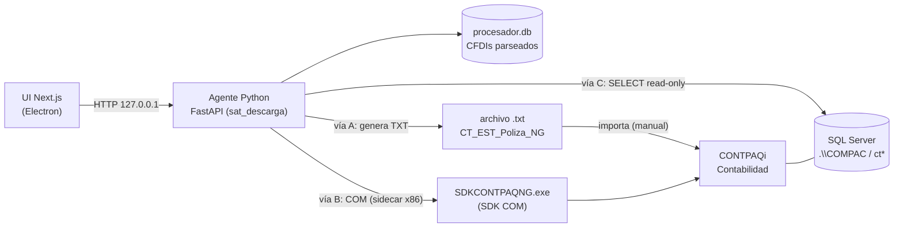

# Integración TodoConta Desktop ↔ CONTPAQi Contabilidad

Documentación técnica para integrar TodoConta Desktop con **CONTPAQi Contabilidad**: enviar
**pólizas** desde los CFDIs de TodoConta hacia CONTPAQi, y **leer** información contable
(catálogo de cuentas, pólizas, saldos) para conciliación.

> **Estado**: documentación de diseño. **Nada de esto está implementado todavía.** Las secciones
> "Propuesta de implementación" describen contratos y módulos listos para ejecutar en una fase
> posterior, sin alterar la app actual.
>
> **Fuentes**: investigación hecha sobre una instalación real de **CONTPAQi Contabilidad 14.4.2**
> (`C:\Program Files (x86)\Compac`) — diccionario de BD, esquemas de importación y **type library
> del SDK** extraídos del disco; ver cada documento para la cita exacta. Notas de la brecha a la
> **v19** en `05-roadmap.md`.

## Objetivo

Cerrar el ciclo **CFDI descargado del SAT → póliza contabilizada → conciliado**, aprovechando que
TodoConta corre un agente local **en la misma máquina** donde vive CONTPAQi — algo que ninguna app
web puede hacer (`docs/presentacion-pitch.md`, Bloque 5). Regla firme heredada del pitch (línea
224): **escribir siempre por la vía que el propio CONTPAQi acepta (archivo o SDK), nunca tocando su
base de datos por dentro**.

## Documentos

| # | Documento | Qué cubre |
|---|---|---|
| — | **README.md** (este) | Visión, arquitectura, entorno detectado, comparativa de vías |
| 01 | [`01-importacion-txt-polizas.md`](01-importacion-txt-polizas.md) | **Escritura vía archivo TXT** — layout campo por campo (esquema `CT_EST_Poliza_NG`), sin licencia SDK |
| 02 | [`02-sdk-com.md`](02-sdk-com.md) | **Escritura vía SDK COM** — API `SDKCONTPAQNG` real, licencia, arquitectura de host x86/x64 |
| 03 | [`03-lectura-sql-server.md`](03-lectura-sql-server.md) | **Lectura read-only** — tablas SQL Server, conciliación UUID↔póliza |
| 04 | [`04-mapeo-cfdi-poliza.md`](04-mapeo-cfdi-poliza.md) | **Reglas contables** CFDI (`CfdiData`) → asientos |
| 05 | [`05-roadmap.md`](05-roadmap.md) | Fases, esfuerzo, riesgos, brecha 14→19, escalabilidad Aspel/Microsip |
| 06 | [`06-plan-mvp-contabilizador.md`](06-plan-mvp-contabilizador.md) | **Plan de implementación del MVP** — módulos, endpoints, config de cuentas, contrato de UI |
| 07 | [`07-brief-ui-contabilizador.md`](07-brief-ui-contabilizador.md) | **Brief de diseño de UI** — para pasar a diseño: flujo, pantallas, estados, microcopy |

## Dónde encaja en TodoConta

La integración vive en el **agente Python** (`sat_descarga/`), no en Electron ni en la UI. Es el
único componente con permisos para tocar código nativo / SQL local. Encaja como un dominio nuevo,
**gemelo estructural del módulo DIOT** (que ya exporta un archivo de formato fijo para un tercero):

- `sat_descarga/contpaq/` — layout, mapeo, exportador (espejo de `sat_descarga/diot/`).
- `sat_descarga/api/routers/contpaq.py` — router montado en `sat_descarga/api/server.py`, junto a
  los `include_router` existentes (mismo patrón que `routers/diot.py`).
- **Fuente de datos**: la tabla `cfdis` de `~/.sat-descarga/procesador.db`
  (`sat_descarga/procesador/db.py`), que ya guarda cada CFDI parseado (`CfdiData` en `raw_json`).

## Entorno detectado (instalación 14.4.2)

| Elemento | Valor |
|---|---|
| Producto / versión | CONTPAQi Contabilidad **14.4.2** |
| Raíz de instalación | `C:\Program Files (x86)\Compac` |
| Empresas | `C:\Compac\Empresas\` (bases `ctEmpresaX` + ADD `adCtEmpresaX`) |
| Motor de BD | **SQL Server Express** (instancia típica `.\COMPAC` / `.\SQLEXPRESS`) |
| SDK | `C:\Program Files (x86)\Compac\SDK\` — **COM `SDKCONTPAQNG`** (51 clases, registrado, v14.4.2) |
| Esquemas de importación | `C:\Compac\Empresas\Esquemas\Contpaq\CT_EST_Poliza_NG.xls` y variantes |
| Diccionario de BD | `C:\Program Files (x86)\Compac\Contabilidad\BDDCONTPAQi.pdf` |
| Contabilidad Electrónica | XSD SAT en `Servidor de Aplicaciones\Extras\schemas\localxsd\` |

## Comparativa de las tres vías

| | **A) TXT** | **B) SDK COM** | **C) SQL read-only** |
|---|---|---|---|
| Dirección | Escritura | Escritura | Lectura |
| Licencia SDK | ❌ No requiere | ⚠️ Usa tu licencia de uso; Multi-RFC para varios clientes | ❌ No requiere |
| CONTPAQi local | ❌ No necesita (multiplataforma) | ✅ Windows + CONTPAQi | ✅ Windows + CONTPAQi |
| Tiempo real | No (importación manual/semi) | Sí | Sí |
| Asocia UUID al ADD | Sí (registro `AD`) | Sí (`TSdkAsocCFDI`) | — |
| Complejidad técnica | Baja (gemelo de DIOT) | Media/alta (COM x86, host) | Baja/media |
| Riesgo | Bajo | Medio | Bajo (solo SELECT) |
| Esfuerzo estimado | 1-2 semanas | 3-4 semanas (+ licencia) | 1-2 semanas |

## Estrategia recomendada

1. **Vía A (Contabilizador TXT) primero** — el gran diferenciador y el MVP. Genera el archivo de
   pólizas (con UUID + folio asociados) desde los CFDIs ya parseados. Es **Python puro, sin SQL,
   sin COM, sin licencia y sin CONTPAQi instalado** → funciona en **Mac/Windows/Linux**. El
   contador lo importa en su CONTPAQi. Ver [nota multiplataforma](#nota-multiplataforma-el-mvp-no-requiere-contpaqi-local).
2. **Vía C (lectura SQL)** — conciliación UUID↔póliza y auto-carga del catálogo de cuentas. Suma
   valor cuando CONTPAQi **sí** está en la misma máquina (solo Windows). Sin licencia.
3. **Vía B (SDK)** como profundización — escritura en tiempo real, condicionada al tier de licencia
   (Mono/Multi-RFC; ver [`02-sdk-com.md`](02-sdk-com.md) §2). Reutiliza el mismo mapeo que la vía A.

### Nota multiplataforma: el MVP no requiere CONTPAQi local

La generación del TXT **no depende de que CONTPAQi esté instalado en la máquina que lo genera**.
Esto habilita el caso de un despacho que trabaja en **Mac**: se genera el TXT ahí y el cliente lo
importa en su Windows. La única entrada que CONTPAQi normalmente daría —el **catálogo de cuentas**—
se desacopla y entra como **dato cargado**, con tres orígenes (de más a menos automático):

1. **Auto-lectura por SQL** de la instalación local (Windows con CONTPAQi) — vía C.
2. **Carga de archivo** exportado del catálogo (Excel/CSV, o el formato `CT_EST_Cuenta_NG`) — el
   modo para **Mac / sin CONTPAQi local**.
3. **Captura manual** de las cuentas por defecto del mapeo.

> **Correctitud**: el catálogo que use TodoConta debe **reflejar el catálogo real** de la empresa
> destino — CONTPAQi rechaza al importar cualquier cuenta inexistente. Por eso el origen confiable
> es el catálogo **exportado del cliente** (o leído por SQL), no códigos inventados. Ver
> [`04-mapeo-cfdi-poliza.md`](04-mapeo-cfdi-poliza.md) §3.

Detalle y criterios de "listo para implementar" en [`05-roadmap.md`](05-roadmap.md).
